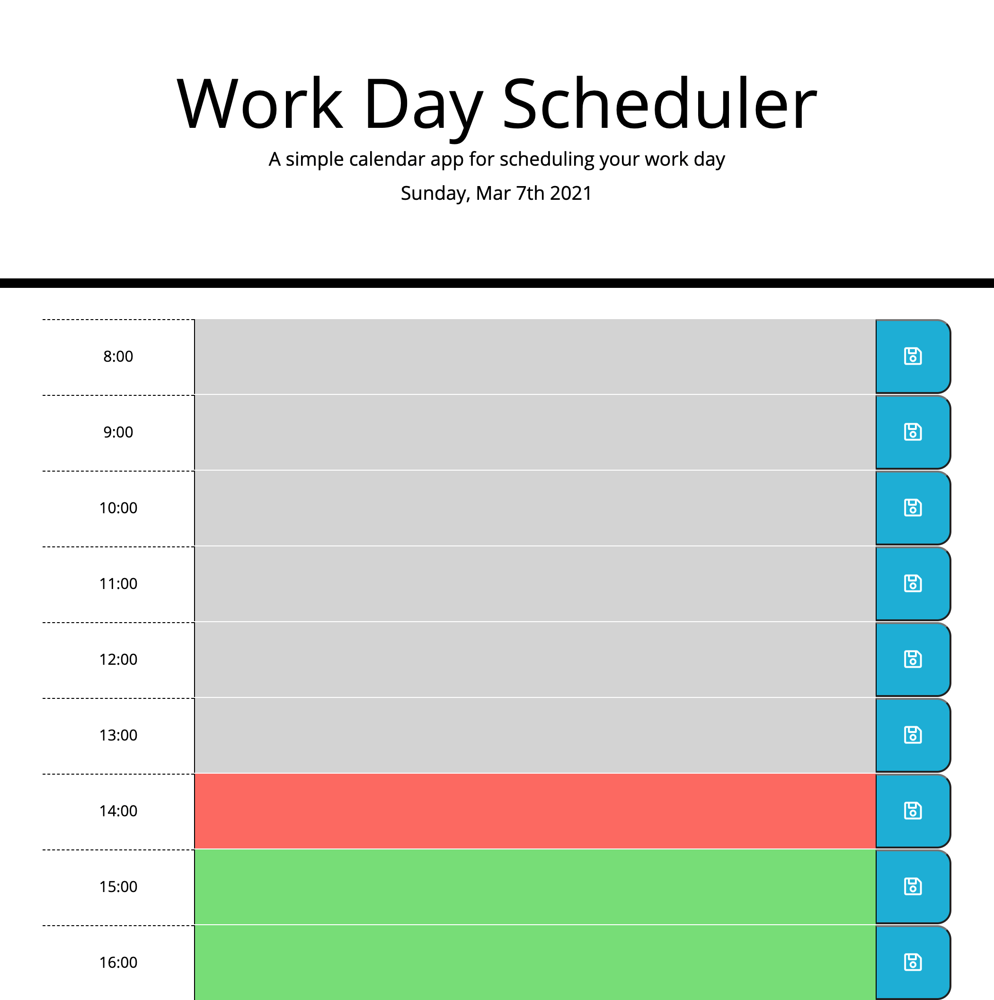

# Daily_Planner

## Description

This app allows you to store tasks for a given day.
The length of the day and number of working hours can be adjusted in variables in script.js.
Time is displayed in military time in the local time zone.
Past hours are grey, the current hour is red, and future hours are green.
The app will reset if a new day is detected.

## Link to Application

https://travis-springer.github.io/Daily_Planner/

## Screenshot

